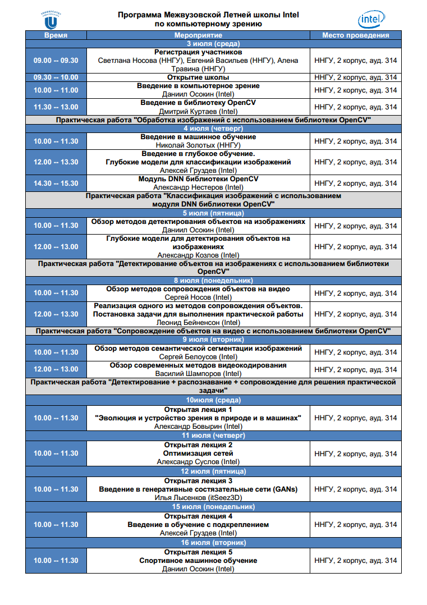

# COMPUTER VISION SUMMER CAMP

## Лекториум

Слайды лекций Летней школы компьютерного зрения расположены в репозитории [CV-SUMMER-CAMP-LECTURES](https://github.com/itlab-vision/CV-SUMMER-CAMP-LECTURES)

## Практикум

Практикум направлен на освоение материала Летней школы Intel по компьютерному зрению 2019 и включает в себя пять лабораторных работ:

1. Введение в разработку проектов с использованием OpenCV. Цель: получение навыков работы с такими инструментами разработки программного обеспечения, как система контроля Git, CMake и Visual Studio; знакомство с библиотекой OpenCV, в частности, с базовыми примитивами работы с изображениями/видео и функциями их обработки, содержащимися в модулях core, imgproc и highgui. 
1. Решение задачи классификации изображений про помощи модуля OpenCV dnn.
1. Решение задачи детектирования объектов.
1. Сопровождения объектов на видео.
1. Разработка приложения для решения задачи, включающей детектирование, классификацию и трекинг (сопровождение) объектов. 

Каждая работа предполагает реализацию некоторого программного модуля и приложения, демонстрирующего разработанный функционал.

## Структура репозитория

Репозиторий содержит следующие директории и файлы:

  - `docs` - директория, содержащая описание практических заданий, и вспомогательные изображения.
  - `headers` - заголовочные файлы нашей библиотеки.
  - `src` - исходный код библиотеки.
  - `samples` - исходные код сэмплов для запуска.
  - `CMakeLists.txt` - общий файл для сборки проектов с помощью CMake.
  - `README.md` - данный файл.
  - `.gitignore`- перечень директорий/файлов, которые игнорируются системой контроля версий.
  
## Инструкции

Описание практических заданий можно найти в следующих документах:

  1. [Практика 1. Инструменты разработки ПО](docs/README_1.md).
  1. [Практика 2. Классификация изображений](docs/README_2.md).
  1. [Практика 3. Детектирование объектов](docs/README_3.md).
  1. [Практика 4. Сопровождение объектов](docs/README_4.md).
  1. [Практика 5. Создание общего приложения из всех
  предыдущих уроков](docs/README_5.md).

## Коммуникация

Для удобства общения между студентами и преподавателями был создан чат [https://gitter.im/CV-SUMMER-CAMP/community](https://gitter.im/CV-SUMMER-CAMP/community), в котором вы можете попросить помощи в решении задач. Приветствуется помощь от студентов студентам, тогда мы сможем сделать еще больше!

