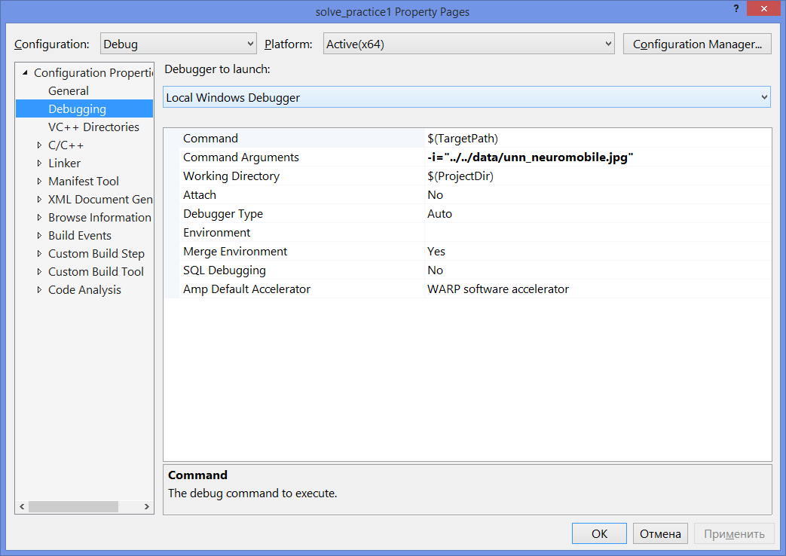

# Практика 1. Инструменты разработки ПО и знакомство с OpenCV

## Цели

__Цель данной работы__ - освоить следующие инструменты 
разработки программного обеспечения:

  - Утилита [CMake](http://www.cmake.org) для сборки исходных кодов.
  - Система контроля версий [Git](https://git-scm.com/book/en/v2).
  - Библиотека OpenCV.
  
## Задачи

__Основные задачи__

  1. Создать серверную копию рабочего репозитория, содержащего
     практические задания школы.
  1. Создать локальную копию (на рабочей машине) репозитория, содержащего
     практические задания школы.
  1. Настроить локальную копию репозитория для последующей синхронизации с сервером.
  1. Разработать:
  
	  1. приложение для открытия исходного изображения из файла и сохранения результирующего изображения в файл;
	  1. фильтр для перевода изображения в оттенки серого;
	  1. фильтр для изменения размера изображения.
  1. Сделать "commit"(зафиксировать) разработанные методы в локальном репозитории.
  1. Отправить "pull request" в основной репозиторий, содержащий шаблоны
     практических заданий школы.

__Дополнительные задачи__
  1. Разработать приложение для открытия изображение/видео/видеопотока с веб-камеры и вывода данных на экран. 
  1. Разработать фильтр для случайного перемешивания частей картинки (см. игру "пятнашки").
  1. Реализовать фильтр для удаления шума методом Гаусса.

## Общая последовательность действий

  1. Сделать форк upstream-репозитория.
  1. Клонировать origin-репозиторий к себе на локальную машину (раздел
     [Общие инструкции по работе с Git][git-intro]).
  1. Собрать проект и проверить его работоспособность, запустив пример
     (раздел [Сборка проекта с помощью CMake и MS VS][cmake-msvs]).
  1. Создать рабочую ветку (раздел [Общие инструкции по работе с Git][git-intro]).
  1. Реализовать отображение картинки на экране при помощи OpenCV.
     По мере готовности не забывайте выкладывать изменения в рабочую ветку на сервер.
  1. Реализовать фильтр, который будет переводить изображение в оттенки серого.
  1. Реализовать фильтр, который будет изменять размер изображения.  
  1. Сделать Pull Request в upstream-репозиторий.
  1. Решить задачи списка [Дополнительные задачи][tasks].
  
  ## Детальная инструкция по выполнению работы

  1. Сделать форк upstream-репозитория.
  
     1. Открыть в браузере upstream-репозиторий
        https://github.com/itlab-vision/CV-SUMMER-CAMP.
     1. В правом верхнем углу нажать кнопку Fork.
     1. Выбрать в качестве организации, куда направить форк, организацию,
        соответствующую вашему аккаунту `@github-account`.

  1. Клонировать origin-репозиторий к себе на локальную машину (раздел
     [Общие инструкции по работе с Git][git-intro]).
     
     1. Открыть командную строку Git Bash (или Git Shell в зависимости от того,
        какой git-клиент установлен на вашей машине). Для этого необходимо найти
        соответствующий ярлык на рабочем столе или в меню "Пуск".
     1. Воспользоваться перечнем инструкций, описанных в разделе
        [Общие инструкции по работе с Git][git-intro]).		
 
   1. Собрать проект и проверить его работоспособность, запустив проект practice1.
     (раздел [Сборка проекта с помощью CMake и MS VS][cmake-msvs]).
     
            - Воспользоваться инструкцией по сборке и запуску, описанной в разделе [Сборка проекта с помощью CMake и MS VS][cmake-msvs]).
            
            - Запустить проект practice1 и удостовериться, что он успешно отработал.

            ```bash
            $ cd CV-SUMMER-CAMP-build/bin
            $ practice1.exe
            ```
	 
  1. Создать рабочую ветку (раздел [Общие инструкции по работе с Git][git-intro]).
	 
  1. Релизовать фильтры:
  
	  1. В файле `filter.h` объявить класс `GrayFilter`, наследника класса `Filter`;
	  1. в файле `filter.cpp` реализовать методы класса `GrayFilter`. 
	  1. Важно! Реализовать метод `ProcessImage`, который возвращает изображение в оттенках серого. Подсказка: используйте фукнцию [`cvtColor`][cvtcolor]. 
	  1. В файле`filter.h` обьявить  класс `ResizeFilter`, наследника класса `Filter`;
	  1. в файле `filter.cpp` реализовать методы класса `ResizeFilter`.
	  1. Важно! реализовать конструктор, принимающий два параметра - новую ширину и высоту изображения;
	  1. Важно! реализовать метод `ProcessImage`, который делает "ресайзинг" исходного изображения и возвращает результат. Подсказка: используйте функцию [`cvResize`][cvresize].
  
   1. Создать копию файла `<project_source>/samples/practice1.cpp` и назвать ее `<project_source>/samples/practice1_YOUR_NAME.cpp`. 

   1. В файле `practice1_YOUR_NAME.cpp` реализовать чтение файла изображения при помощи имени файла, полученного из аргументов командной строки, и вывести это изображение на экран.
  
   1. Убедиться, что проект успешно собирается и создается новый исполняемый файл `<project_build>/bin/practice1_YOUR_NAME.exe`.
   
   1. В файле `practice1_YOUR_NAME.cpp` создать объект класса `GrayFilter`, применить метод `ProcessImage` к изображению, результат вывести на экран.
   
   1. В файле `practice1_YOUR_NAME.cpp` создать объект класса `ResizeFilter`, применить метод `ProcessImage` к изображению, результат вывести на экран. Размеры изображения передаются аргументы командной строки.
  
  1. Прислать Pull Request с внесенными изменениями. Пометить в конце названия `(NOT READY)`. По мере готовности решений основных задач Pull Request можно будет переименовать.
  1. Решить задачи списка [Дополнительные задачи][tasks].

  
## Общие инструкции по работе с Git

В данном разделе описана типичная последовательность действий, которую
необходимо выполнить перед тем, как начать работать с проектом. Далее
для определенности используется репозиторий `CV-SUMMER-CAMP`.

  1. Создать аккаунт на [github.com](https://github.com), если такой
     отсутствует. Для определенности обозначим аккаунт `github-account`.

  1. Сделать fork репозитория
     <https://github.com/itlab-vision/CV-SUMMER-CAMP> (в
     терминологии Git upstream-репозиторий) к себе в личный профиль с названием
     `github-account`. В результате будет создана копия репозитория 
     <https://github.com/github-account/CV-SUMMER-CAMP>
     (origin-репозиторий).

  1. Клонировать [origin][origin] репозиторий к себе на локальный компьютер,
     воспользовавшись следующей командой:

        ```bash
        $ git clone https://github.com/   <github-account>   /CV-SUMMER-CAMP
        ```

  1. Перейти в директорию `CV-SUMMER-CAMP`:

        ```bash
        $ cd ./CV-SUMMER-CAMP
        ```

  1. Настроить адрес upstream-репозитория (потребуется при обновлении локальной
     версии репозитория):

        ```bash
        $ git remote add upstream https://github.com/itlab-vision/CV-SUMMER-CAMP
        ```

  1. Настроить имя пользователя и e-mail, из под которого будут выполняться
     все операции с репозиторием Git:

        ```bash
        $ git config --local user.name "github-account"
        $ git config --local user.email "github-email"
        ```

        Примечание: если не выполнить указанную операцию при попытке
        размещения изменений на сервер, они попадут под аккаунтом пользователя
        компьютера.
  
  1. Настроить редактор, который будет использован, если вносятся изменения
     в историю репозитория (в частности, при слиянии веток).
  
        ```bash
        $ git config --local core.editor "'C:/Program Files (x86)/Notepad++/notepad++.exe' -n -w"
        ```
        
        Когда сделан форк репозитория у вас создается по умолчанию единственная ветка
        master. Тем не менее, при решении независимых задач следует создавать рабочие
        ветки. Далее показаны основные команды для управления ветками на примере ветки
        `practice-1`.

  1. Получить список веток:

        ```bash
        $ git branch [-v]
        # [-v] - список с информацией о последних коммитах
        ```

  1. Создать ветку:

        ```bash
        $ git branch practice-1
        ```

  1. Создать ветку `practice-1` и перейти в нее:

        ```bash
        $ git checkout [-b] practice-1
        # [-b] - создание и переход в ветку <branch_name>
        ```
  1. Удалить ветку в локальном репозитории:

        ```bash
        $ git branch -d <branch_name>
        ```

  1. Удалить ветку на сервере:

        ```bash
        $ git push [remotename] :[branch]
        # [remotename] - имя удалённого репозитория. Если следовать приведённой
        #     инструкции, то origin - репозиторий пользователя github-account, upstream -
        #     репозиторий itlab-vision/CV-SUMMER-CAMP
        ```

При работе с файлами в ветке необходимо управлять изменениями. Далее приведен
перечень основных команд в предположении, что текущей рабочей веткой
        является `practice-1`.

  1. Получить список текущих изменений:

        ```bash
        $ git status
        ```

  1. Пометить файл как добавленный в текущую ветку репозитория (файл будет
     добавлен после выполнения команды `commit`):

        ```bash
        $ git add [<file_name>]
        # <file_name> - название файла для добавления в commit
        #     если вместо имени указан символ *, то будут добавлены все новые файлы,
        #     не совпадающие с масками, указанными в .gitignore
        ```

  1. Добавить изменения в текущую ветку локального репозитория:

        ```bash
        $ git commit [-m "<message_to_commit>"] [-a]
        # [-a] - автоматически добавляет изменения для существующих на сервере файлов
        #     без выполнения команды git add
        # [--amend] - перезаписывает последний коммит (используется, если не забыты
        #     изменения)
        ```

  1. Разместить изменения, которые были добавлены в локальный репозиторий
     с помощью команды `commit`:

        ```bash
        $ git push [-u] origin [practice-1]
        # [-u] - отслеживать версию ветки [practice-1] на удалённом сервере
        #     (origin). Позволяет получать изменения с сервера при помощи команды git pull
        #     без явного указания имени удалённого репозитория и имени ветки.
        ```

  1. Получить изменения с сервера при помощи команды `pull` и слить их с
     отслеживаемыми ветками:

        ```bash
        $ git pull [remotename [<branch name>]]
        ```

  1. Удалить файлы или директории (!без опции `-f` для файлов, состояния
     которых совпадают с состояниям на сервере):

        ```bash
        $ git rm [-f] [--cached]
        # [-f] - принудительное удаление (файла с измененным состоянием)
        # [--cached] - удаление файлов на сервере, но не в локальной директории
        ```

  1. Переименовать файлы (или 3 команды: `mv`, `git rm`, `git add`):

        ```bash
        $ git mv <file_from> <file_to>
        ```

Когда в проекте работает несколько человек, то вполне естественная ситуация -
необходимость слияния изменений и разрешение конфликтов.

  1. Слияние (вариант 1):

        ```bash
        $ git merge upstream/master # слияние изменений из ветки upstream в master
        $ git merge master # слияние изменений из ветки master в текущую ветку
        ```

  1. Слияние (вариант 2):

        ```bash
        $ git checkout <branch_name> # переход в ветку <branch_name> (при необходимости)
        $ git rebase <base_branch> [<branch_name>] # слияние изменений из ветки <base_branch> в ветку <branch_name>
        $ git checkout <base_branch>
        $ git merge <branch_name>
        ```

  1. Инструмент для разрешения конфликтов:

        ```bash
        $ git mergetool
        ```

## Сборка проекта с помощью CMake и Microsoft Visual Studio 2015

В данном разделе описана типичная последовательность действий, которую
необходимо выполнить для сборки проекта с использованием утилиты CMake и
Microsoft Visual Studio 2015 или Microsoft Visual Studio 2017.
Далее для определенности выполняется сборка проекта
из репозитория `CV-SUMMER-CAMP`.

  1. Рядом с директорией `CV-SUMMER-CAMP` создайте
     `CV-SUMMER-CAMP-build`. В новой директории будут размещены файлы
     решения и проектов, сгенерированные с помощью CMake.

        ```bash
        $ cd ..
        $ mkdir CV-SUMMER-CAMP-build
        ```

  1. Перейдите в директорию `CV-SUMMER-CAMP-build`:

        ```bash
        $ cd ./CV-SUMMER-CAMP-build
        ```

  1. Сгенерируйте файлы решения и проектов с помощью утилиты CMake. Для этого
     можно воспользоваться графическим приложением, входящим в состав
     утилиты, либо выполнить следующую команду:

        ```bash
        $ cmake -DOpenCV_DIR="<OpenCVConfig.cmake-path>" -G <generator-name> <path-to-CV-SUMMER-CAMP>
        # <OpenCVConfig.cmake-path> - директория, в которой установлена
        #     библиотека OpenCV и расположен файл OpenCVConfig.cmake
        # <generator-name> - название генератора, в случае тестовой
        #     инфраструктуры участников школы может быть "Visual Studio 14 2015 Win64"
        #     (если в командной строке набрать cmake без параметров, то можно просмотреть
        #     список доступных генераторов)
        # <path-to-CV-SUMMER-CAMP> - путь до директории
        #     CV-SUMMER-CAMP, где лежат исходные коды проекта (если предыдущие действия
        #     выполнены корректно, то это директория`../CV-SUMMER-CAMP`)
        ```
        Обратите внимание, что для сборки проекта необходима версия OpenCV 4.x,
        например, 4.1.0, которую можно скачать [здесь](http://opencv.org/downloads.html).
        В терминал-классах OpenCV 4.1.0 установлена в директорию `С:\OpenCV41\opencv\build`

С решения `CV_SUMMER_CAMP.sln`. В терминал-классах
     Microsoft Visual Studio располагается по пути:
     `C:\Program Files (x86)\Microsoft Visual Studio 14.0\Common7\IDE\devenv.exe` или `C:\Program Files (x86)\Microsoft Visual Studio 15.0\Common7\IDE\devenv.exe
  1. Нажмите правой кнопкой мыши по проекту `ALL_BUILD` и выберите пункт
     `Rebuild` контекстного меню, чтобы собрать решение. В результате все
     бинарные файлы будут размещены в директории
     `CV-SUMMER-CAMP-build/bin`.
  1. Для запуска приложения и тестов откройте командную строку (`cmd.exe` в `Пуск`)
     и перейдите в директорию с бинарными файлами, используя команду `cd`.
  1. Можно запустить шаблонное приложение `practice1.exe`. Возможное сообщение
     при запуске: `The program can't start because
     opencv_world401.dll is missing from your computer. Try reinstalling
     the program to fix this problem.`. Решение 1: скопировать
     соответствующую библиотеку из `С:\OpenCV41\opencv\build\x64\<vcXX>\bin` (где <vcXX> - версия Visual Studio, которую вы используете) к бинарным файлам проекта. Решение 2: добавить путь `С:\OpenCV41\opencv\build\x64\<vcXX>\bin`
     в переменную окружения `PATH`.

## Запуск приложений
Во время прохождения школы вы будете создавать приложения, в которых некоторые переменные, например пути к файлам, не зашиты во время компиляции, а передаются при помощи параметров запуска. Здесь можно поступать двумя способами.
  1. Запуск с параметрами из командной строки. В проводнике необходимо открыть папку, в которой находится собранное вами приложение, и в строке путь набрать команду `cmd`. Откроется командная строка, в которой нужно набрать полное имя приложения, далле идут имена параметров и через знак `=` значения параметров, например:

        ```bash
        $ sample.exe -i="../../СV-SUMMER-CAMP/data/unn_neuromobile.jpg"
        ```
  1. Запуск с параметрами из Visual Studio. В этом случае необходимо открыть свойства проекта, выбрать правильную конфигурацию проекта (Debug, Release), далее в свойствах выбрать раздел меню `Debugging`, и в элементе `Debugging Arguments` внести ваши параметры.

        

## Добавление аргументов командной строки в приложение

Список параметров для приложения задается в строке строке `cmdOptions`, дополнительные параметры вам нужно добавить самостоятельно.

        ```cpp
        const char* cmdOptions =
        "{ i  image         | <none> | image to process        }"
        "{ w  width         | <none> | width for image resize  }"
        "{ h  height        | <none> | height for image resize }"
        "{ q ? help usage   | <none> | print help message      }";
        ```
## Структура исходного кода

  1. В папке `src` расположен файл `filter.h`, который содержит объявление абстрактного класса `Filter`, а также файл `filter.сpp`, в котором будут храниться реализации методов классов-наследников. `ProcessImage` - виртуальный метод для фильтрации изображения.
  1. В папке `samples` расположен файл `practice1.cpp`, в котором представлена функция `main` - точка входа в программу.
 

<!-- LINKS -->
[origin]: https://github.com/itlab-vision/CV-SUMMER-CAMP
[cvtcolor]: https://docs.opencv.org/3.4.2/d7/d1b/group__imgproc__misc.html#ga397ae87e1288a81d2363b61574eb8cab
[cvresize]: https://docs.opencv.org/3.4.2/df/d4e/group__imgproc__c.html#ga1119b1dc4f6db2a393057992ed574e25
[git-intro]: https://github.com/FenixFly/CV-SUMMER-CAMP/blob/dev/docs/README_1.md#%D0%BE%D0%B1%D1%89%D0%B8%D0%B5-%D0%B8%D0%BD%D1%81%D1%82%D1%80%D1%83%D0%BA%D1%86%D0%B8%D0%B8-%D0%BF%D0%BE-%D1%80%D0%B0%D0%B1%D0%BE%D1%82%D0%B5-%D1%81-git
[cmake-msvs]: https://github.com/FenixFly/CV-SUMMER-CAMP/blob/dev/docs/README_1.md#%D1%81%D0%B1%D0%BE%D1%80%D0%BA%D0%B0-%D0%BF%D1%80%D0%BE%D0%B5%D0%BA%D1%82%D0%B0-%D1%81-%D0%BF%D0%BE%D0%BC%D0%BE%D1%89%D1%8C%D1%8E-cmake-%D0%B8-microsoft-visual-studio-2015
[tasks]: https://github.com/FenixFly/CV-SUMMER-CAMP/blob/dev/docs/README_1.md#%D0%B7%D0%B0%D0%B4%D0%B0%D1%87%D0%B8
